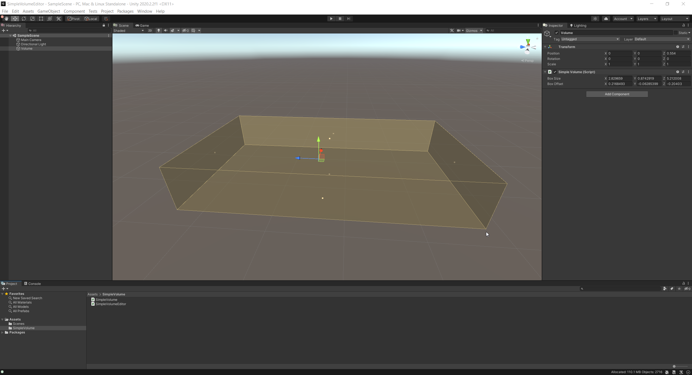

# SimpleVolumeEditor

This project implements a simple Volume / AABB gizmo for Unity Editor. The code uses **BoxBoundsHandle** Unity class for handle interaction and rendering.

The gizmo is implmeneted in SimpleVolumeEditor.cs file.

